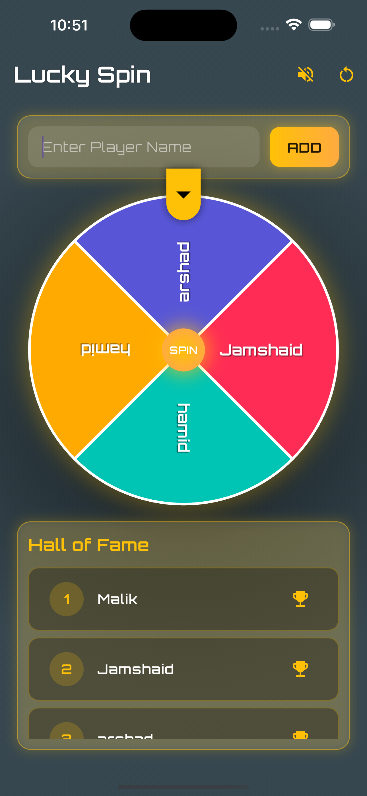

# 🎯 LuckyWheel

**LuckyWheel** is a fun and interactive Flutter app that allows users to spin a customizable wheel to randomly select a winner from a list of names. Ideal for giveaways, classroom activities, games, or making decisions!

---


## 🚀 Features

- Spin a colorful, animated wheel
- Add and remove participant names
- Fully customizable entries
- Random winner selection
- Smooth animations and sound effects

---

## 🛠️ Getting Started

### Prerequisites

- **Flutter**: 3.32.0
- **Dart**: 3.8.0
- **DevTools**: 2.45.1

Make sure you have Flutter installed. You can verify it by running:

```bash
flutter doctor
```

## Installation

### Clone the repository

```bash
git clone https://github.com/JamshaidMallik/LuckyWheel_app.git
cd LuckyWheel_app
```

### Install dependencies

```bash
flutter pub get
```
### Run the app
```bash
flutter run
```


## 🤝 Contributing
Pull requests are welcome! For major changes, please open an issue first to discuss what you would like to change.

## 👨‍💻 Author
Built with ❤️ using Flutter 3.32.0 and Dart 3.8.0
- [**Jamshaid Malik**](https://github.com/JamshaidMallik)